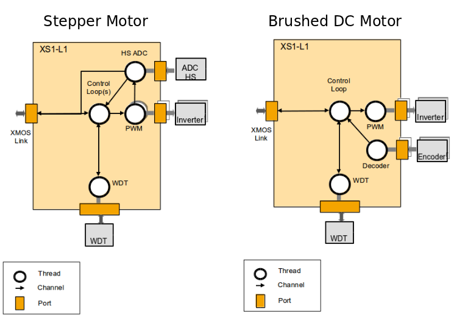

Overview
========

These examples provide basic functionality for DC and Stepper motor control. 
All examples run on the XP-MC-CTRL-L2 motor control board. 

Features
~~~~~~~~
* Stepper Motor
    - Microstepping
        + Number of microsteps configurable between 0 and 256
    - Chopping / Current Limiting
        + Open loop chopping limits duty cycle to theoretical max current according to phase resistance of motor
        + Closed loop chopping uses ADC to chop current when it rises above a set maximum
    - Decay Modes
        + Fixed decay uses slow decay at all times
        + Alternating decay uses slow decay whilst current is rising and fast decay whilst current is falling
    - Closed loop current control
        + uses a PI controller to adjust current
        
* DC Motor
    - Control of 2 DC motors
    - PI loop for speed control
    
Thread diagrams for both applications are shown below:   

